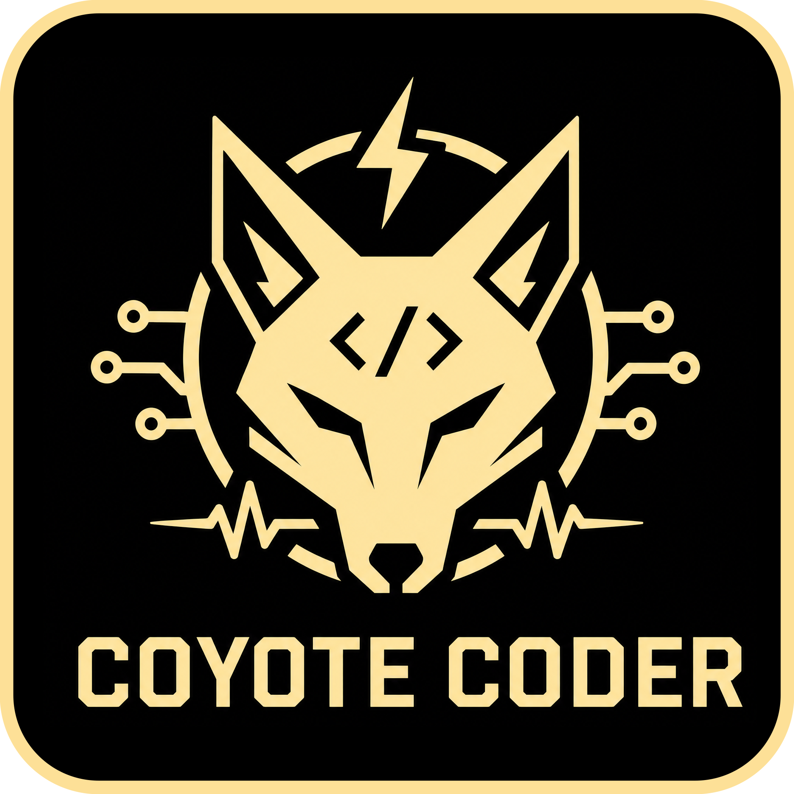

<div align="center">



# CoyoteCoder

[](https://github.com/Piracola/CoyoteCoder/actions/workflows/portable-windows.yml)
[](https://github.com/Piracola/CoyoteCoder/releases)


CoyoteCoder 是一个为 Vibe Coding 场景适配的本地监听工具。

它位于你的 AI 客户端与上游大模型服务之间，负责监听模型响应，并将相应的反馈指令发送至 DG-LAB 设备。

让 Vibe Coding 更有参与感。

</div>

## ✨ 核心特性

- **无缝接入**：下游客户端继续使用兼容 OpenAI 的 API 格式，只需修改 Base URL。
- **可视化管理**：内置 Web/桌面控制台，集中配置上游模型、API Key 及 DG-LAB 配对状态。
- **隐私优先**：默认不保存原始请求内容，仅记录统计信息，减少提示词与 API Key 暴露风险。
- **安全机制**：首次启动默认进入“预览模式”（仅记录计划，不输出到物理设备），内置紧急停止（Panic）接口。

***

## 🚀 快速开始

1. 在 [Releases](https://github.com/Piracola/CoyoteCoder/releases) 下载最新 Windows 便携版（zip）并解压。
2. 运行 `CoyoteCoder.exe` 启动主程序（首次运行会自动生成 `config.yaml` 配置文件）。
3. 在弹出的控制台中，前往“API 供应商”填写你的上游模型服务和 API Key。
4. 将你的下游 AI 客户端的 Base URL 修改为：<http://127.0.0.1:8787/v1>

*(注：如需卸载，直接删除解压文件夹即可。)*

## 🔗 DG-LAB 配对与真实反馈

1. 确保本地 [DG-LAB Socket V2](https://github.com/DG-LAB-OPENSOURCE/DG-LAB-OPENSOURCE/tree/main/socket/v2) 服务可访问（默认地址为 `ws://127.0.0.1:9999`）。
2. 在 CoyoteCoder 控制台中生成配对码，并使用**郊狼 APP** 扫描二维码完成配对。
3. **安全调试**：建议初期在控制台保持预览模式，确认行为符合预期。
4. **实机运行**：需要真实硬件反馈时，在控制台关闭预览模式，并点击“启动反馈”。

**🚨 紧急停止 (Panic) 接口**
如遇异常，可立即调用此接口阻断输出：

```
Invoke-RestMethod -Method Post http://127.0.0.1:8787/control/panic
```

## ⚙️ 进阶配置

程序运行后会在同级目录生成 `config.yaml`。你可以通过控制台或直接修改文件来调整进阶参数，例如更改服务端口或 Socket 地址。

若未运行桌面端 GUI，或需在局域网内管理，可通过浏览器直接访问 Web 控制台：
<http://127.0.0.1:8787/ui>

## 🛠️ 开发者指南

关于本地开发、构建打包、接口规范及验证命令，请参阅 [DEVELOPMENT.md](./DEVELOPMENT.md)。

***

## ❤️ 致谢

感谢 [Linux Do](https://linux.do/) 热心佬友提供的项目灵感。
